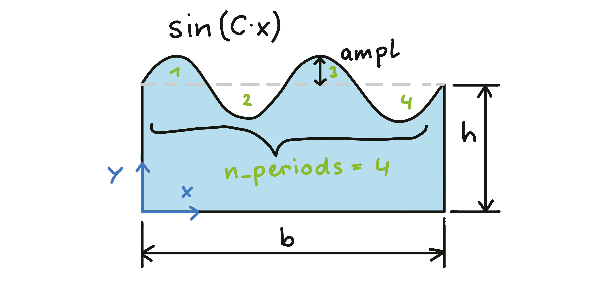
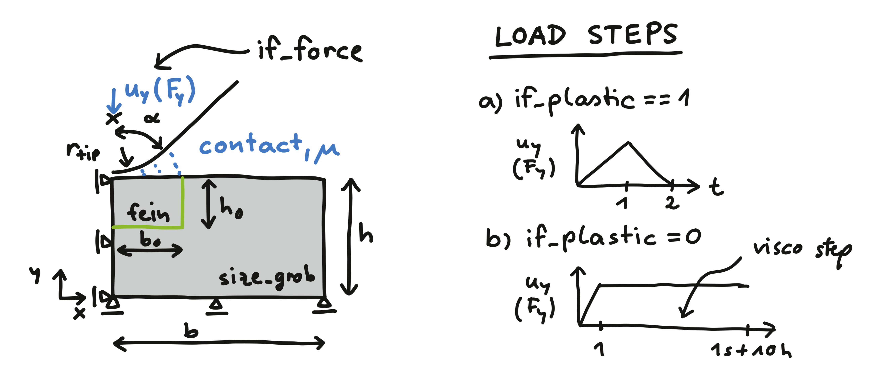
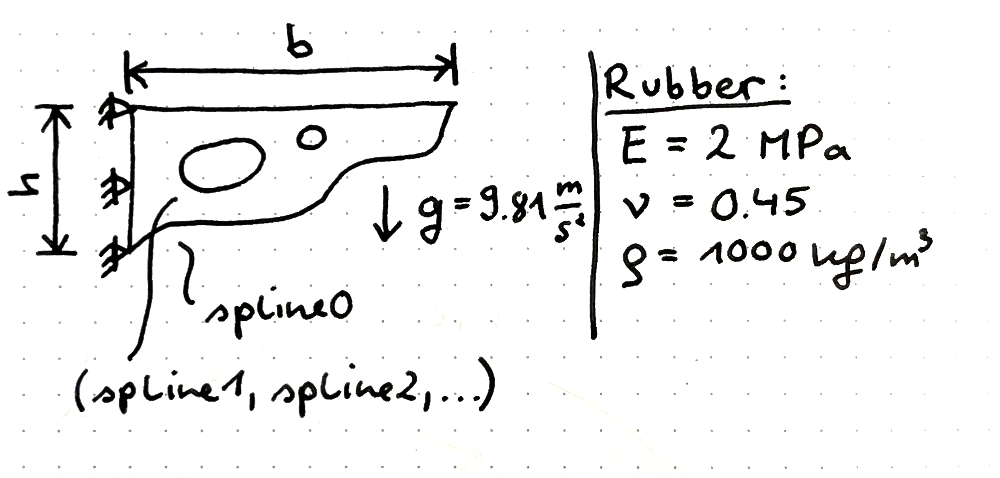

# Abaqus/Python course in the winter term 2022/23

Scripts and ressources for the [Abaqus/Python](https://online.unileoben.ac.at/mu_online/ee/ui/ca2/app/desktop/#/slc.tm.cp/student/courses/3212968) seminar. The script of the course exists in [pdf](https://www.researchgate.net/publication/345680663_Efficient_FE_Modelling_Course_Scripting_Abaqus_CAE_using_Python) and [html](https://www.martinpletz.com/fe-scripting) form. We will go through the crucial steps for automating Abaqus CAE models using Python. Each of the participants will then apply those skills to an example, that she/he presents in the final unit.

### Unit 1, 2022-10-06
* Motivation of scripting the Abaqus CAE interface
* Introduction round: AMB, PCCL, Mech/MCL, PCCL, PCCL
* Running scripts in Abaqus
* Record Abaqus CAE commands: `.rpy`, `.jnl`, or macro-files.
* Some general statements and header for Abaqus Python script (`import`, `Mdb()`, etc.)

### Unit 2, 2022-10-13
* Recap of unit 1
* Exercise: Create sketch with wavy surface (`sin`-function in a spline using `NumPy` functions.
* Introduction to handling  `vertices`, `edges`, `faces`, and `cells` using Python. How to make sets or surfaces out of them.

### Unit 3, 2022-10-20
* We looked into how to select entities in Abaqus and create sets out of that.
* findAt, getByBoundingBox, properties of entity (size, etc.)

### Unit 4, 2022-10-27
* You guys can start thinking about what example to use (it should be simple, easy to test, and have nothing to do with your research field) 
* MP brought a working indenter model without evaluation functions
* We looked into how to load the odb and write the history output into a dat file.
* _Scripts that run the model and wait for completion crash if run in an interactive way (i.e., when started using "Run Script" or script=... in the command line)_

### Unit 5, 2022-11-10
* We revisited the evaluation of the history output from the last unit
* We looked into how to automatically generate images out of Abaqus models (png, svg). There was an error in my code because I deleted `from caeModules import *` because the viewer module is a cae module.

### Unit 6, 2022-11-17
* Short look into printing images from last unit
* Discussion of modeling and how to select a problem and work on your projects (first image in <www.martinpletz.com/fe-scripting-2>)
  * Possible problems: Pasta that deforms during cooking, Tipping of things in the supermarket conveyor, Spokes of a bicycle wheel, Transmitting forces with the hair of a toothbrush, Biting on a nut: Plastic deformation first, then fracture, Opening a shampoo bottle: M(phi): Why?, Bicycle crank stress depending on angle and geometry.
* Start with scripting on a simple model: Geometry, Sections, ... (**Aim: Finish it by the end of next week**)

#### Simple FEM model to script
A cantilever beam that is loaded by its own weight (plane stress) with linear elastic material law. The width $b$ is 120 mm and the height $h$ is 40 mm. Write the vertical displacement of the top right point into a history output, because we want to play with that, later.

To check if the splines are ok to build a valid 2D geometry, print an image of the skecth once it is created. This will hel with debugging a lot! The gravity load can be created with the `Create Predefined Field` button.

### Unit 7, 2022-11-24
* Continue to work on the cantilever beam that is loaded by its own weight
* The splines for the geometry can also be created using an [Android App](https://play.google.com/store/apps/details?id=mul.kkv.FEMon2) (documented [here](https://www.kunststofftechnik.at/fileadmin/shares/kunststofftechnik/lehrstuhl/Konstruieren_in_Kunst-_und_Verbundstoffen/Docs/FEMon.pdf) in German). If you there save the geoemtry that you recognized from a drawing as a .json-file, you can use the function and code lines from the script `get_cantilever_splines.py` in the folder 'unit-7'.

### Unit 8, 2022-12-01
* Looked into the [section](www.martinpletz.com/fe-scripting-6) about tidying up the code. There, we saw how to run Abaqus models in subfolders with specific names and delete unwanted calcultation files.
* Continued working on example from unit 6: The deadline to finish isthat until christmas (please send it per e-mail to Martin).
* Discussed your ideas for the project examples (you should also decide that until christmas):
  * Wolfgang: Gummibears (maximum size until plastic deformation under its own weight) & plasticity, paraview
  * Martin K.: Barbell falling on ground (or being lifted): Fracture or plastic deformation? 
  * Benjamin: Steel plate stove
  * Julia: Inner pressure: Failure of soda can or PET bottle
  * Martin T.: Morphing pasta (soaking and corresponding deformation of pasta)
  * Philip: Pressing a filled soda can until failure (including tests)

### Unit 9, 2022-12-15
* Repeated stuff on tidying the code
* Question by Martin K.: how to run Abaqus/Python file from Python? This can be done with the command `subprocess.call('abaqus cae',shell=True)` which for example opens a cmd window.
* Continued working on the example from unit #6. The output shoul contain an image of the deformed cantilever (possibly with a deformation scale factor > 1 to better see the deformation) and a text file for each calculation containing the end point displacement.
* Plan for the January units #10 and #11: _Open Lab_ for working on code and performing experiments. Martin P. will bring spring scales, recording equipment, and other stuff for the experiments.

### Unit 10, 2023-01-12
* Free unit for working on projects
* I recommend working like that: Draw model sketch: does it make sense? yes --> CAE Model, manually built: does it work and give meaningful results? yes --> Script the model

### Unit 11, 2023-01-19
* Another free unit for working on your projects

### Unit 12, 2023-01-26
* The last unit before the presentations
* Martin K. found the Python Package [pyabaqus 2022](https://pypi.org/project/pyabaqus/) that can help you write Abaqus/Python code in your editor (code completion, docstrings, telling you if some commands are not defined).
* 