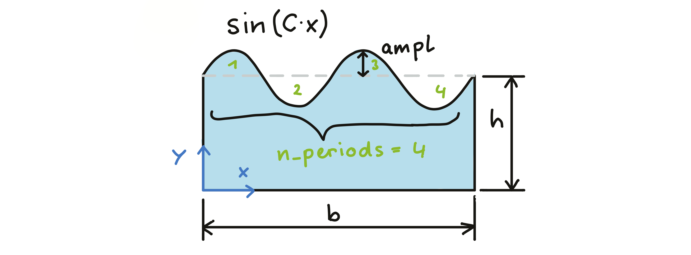

# Abaqus/Python course in the winter term 2022/23

Scripts and ressources for the [Abaqus/Python](https://online.unileoben.ac.at/mu_online/ee/ui/ca2/app/desktop/#/slc.tm.cp/student/courses/3212968) seminar. The script of the course exists in [pdf](https://www.researchgate.net/publication/345680663_Efficient_FE_Modelling_Course_Scripting_Abaqus_CAE_using_Python) and [html](https://www.martinpletz.com/fe-scripting) form. We will go through the crucial steps for automating Abaqus CAE models using Python. Each of the participants will then apply those skills to an example, that she/he presents in the final unit.

### Unit 1, 2022-10-06
* Motivation of scripting the Abaqus CAE interface
* Introduction round: AMB, PCCL, Mech/MCL, PCCL, PCCL
* Running scripts in Abaqus
* Record Abaqus CAE commands: `.rpy`, `.jnl`, or macro-files.
* Some general statements and header for Abaqus Python script (`import`, `Mdb()`, etc.)

### Unit 2, 2022-10-13
* Recap of unit 1
* Exercise: Create sketch with wavy surface (`sin`-function in a spline using `NumPy` functions.
* Introduction to handling  `vertices`, `edges`, `faces`, and `cells` using Python. How to make sets or surfaces out of them.

### Unit 3, 2022-20-20
* We looked into how to select entities in Abaqus and create sets out of that.
* findAt, getByBoundingBox, properties of entity (size, etc.)

### Unit 4, 2022-20-27
* You guys can start thinking about what example to use (it should be simple, easy to test, and have nothing to do with your research field) 
* MP brought a working indenter model without evaluation functions
* We looked into how to load the odb and write the history output into a dat file.
* _Scripts that run the model and wait for completion crash if run in an interactive way (i.e., when started using "Run Script" or script=... in the command line)_

